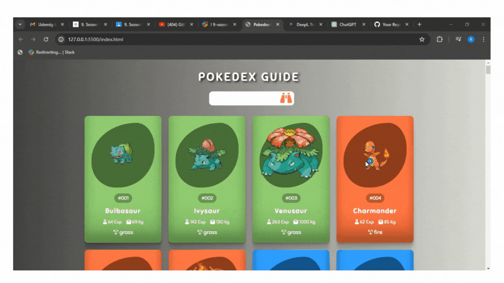

## Pokedex-Guide

- Bu proje, JavaScript kullanarak geliştirilmiş interaktif bir Pokedex rehberidir. Pokemon hayranları için tasarlanmış olan bu rehber, kullanıcıların herhangi bir Pokemon'un detaylı bilgilerini bulmalarına yardımcı olur. Projede, Pokemon'un resmi, türleri, yetenekleri, istatistikleri ve daha fazlası gibi çeşitli bilgiler bulunmaktadır. 

- JavaScript, HTML, CSS kullanarak tasarlandı. 

### Kullanım

- Pokedex'te arama çubuğunu kullanarak istediğiniz Pokemon'u arayın. 

-Arama sonuçlarından istediğiniz Pokemon'u seçin. 

- Pokemon'un resmi, türleri, istatistikleri ve diğer bilgileri görüntüleyin.

### Gif

